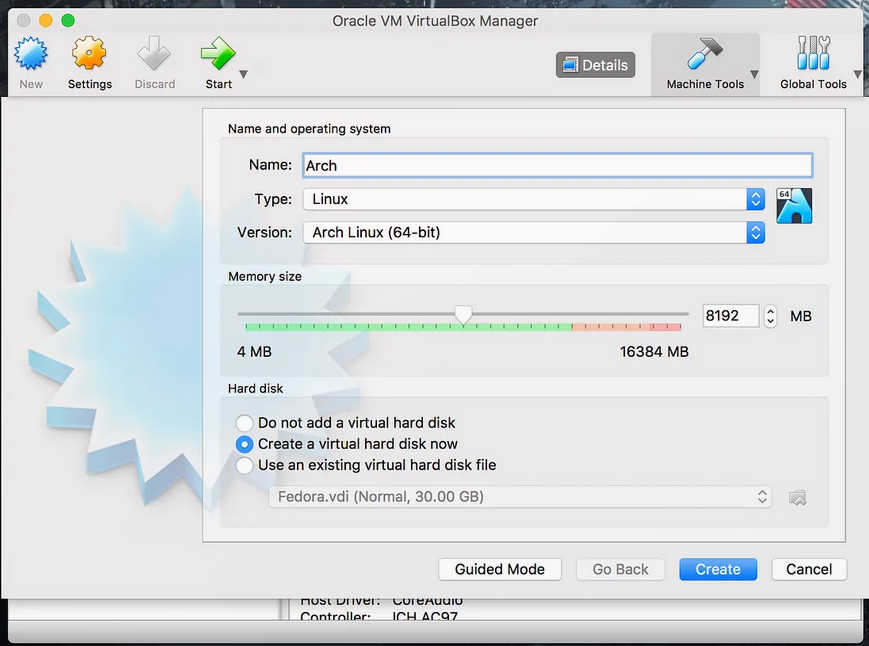
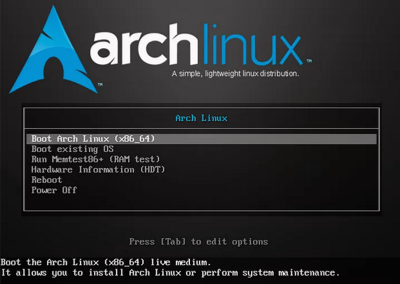
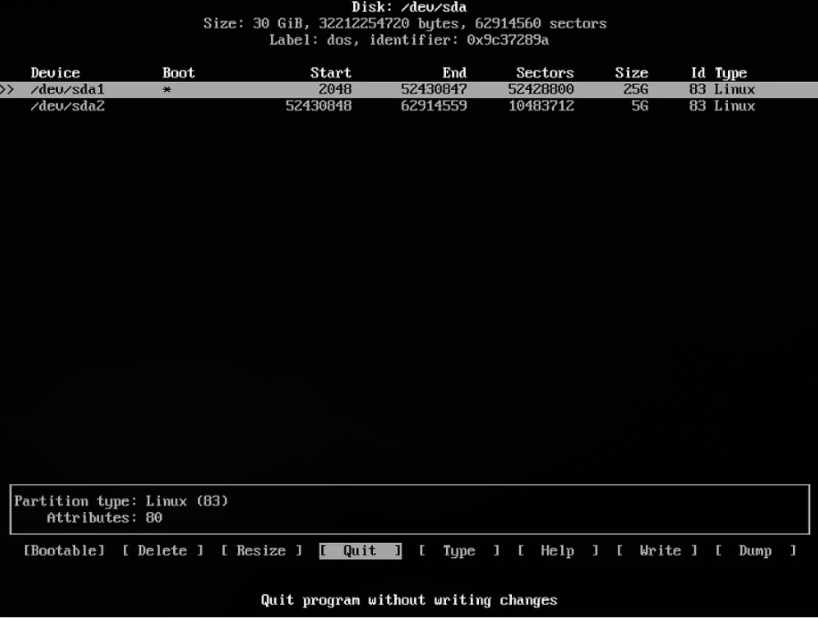
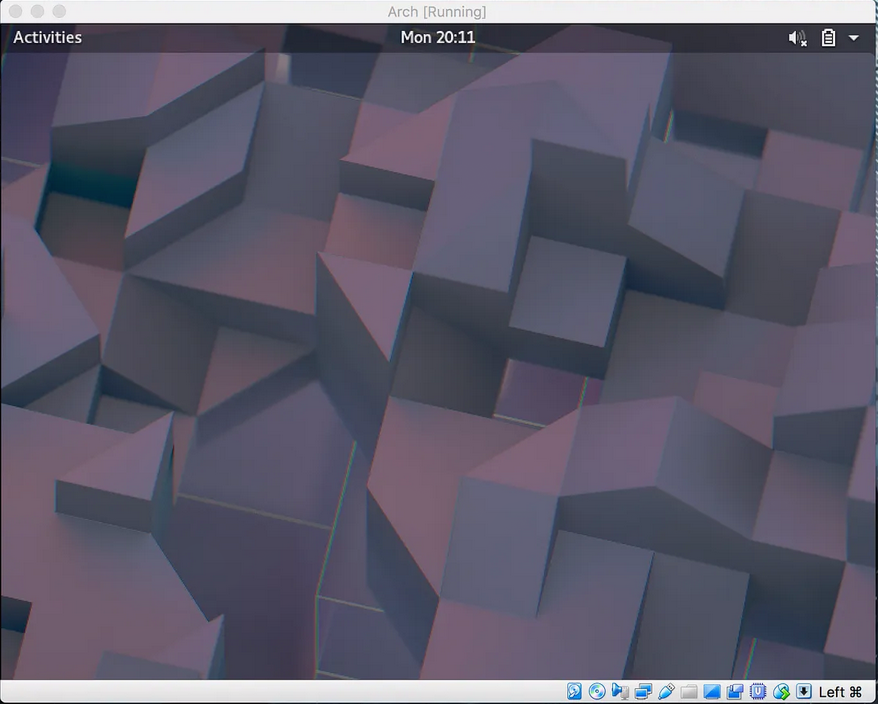
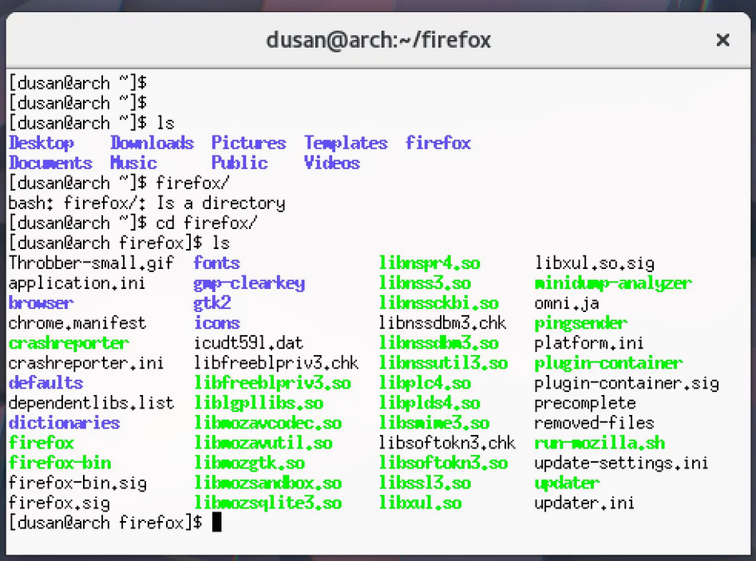
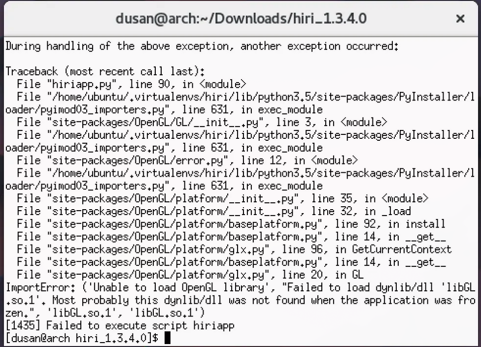

+++
date = '2017-11-27T23:41:52-05:00'
draft = false
title = 'An Unexpected Journey - Arch Linux & Virtual Box'
tags = ["linux", "arch", "virtualbox"]
+++

> This post was originally on my medium account

Recently I had some laptop misfortune. Long story short, I am departing my comfortable developer life in MacOS for a journey of undetermined length in the diverse lands of the Linux desktop.

I am by no means a Linux newbie: in my day-to-day I administer more Linux servers than I care to count, spread across a half dozen commercial, academic, and private clouds, and I’ve even had a job title with the words “Linux” and “Specialist” in the name.

All this experience and knowledge comes crashing down however, once I need to figure our problems like “which email client will sync with Microsoft Exchange.” So in an effort to grab the bull by the horns, I’ve decided to try exploring what I take for granted before my real journey begins: when my new laptop arrives.

---

## The Machine

As I already have VirtualBox installed, the first thing I do is download the x64 image for Arch. I fire up Virtual Box and begin the basic configuration of the virtual machine. I’ve decided on Arch both because I want to see how my Linux skills hold up and also because when playing video games, if presented a choice between Normal and Hard, I choose Nightmare.

  <figure style="width: 90%;">
      
      <figcaption>Nothing fancy going on here</figcaption>
  </figure>

Once the Virtual Machine is ready, I mount the .iso and hit start. Since there were not too many places to go wrong, I’m presented with the Arch Linux boot screen.

  <figure style="width: 80%;">
      
      <figcaption>I always appreciate nice logos</figcaption>
  </figure>

Selecting the first option, the kernel does its magic and we are dropped into a shell. This is where I first experience what I call “distro shock.” Having been spoiled by the installers provided by distros likes CentOS and Ubuntu I was expecting something and got nothing. Quickly skimming the docs on the Arch website, it looks like it’s all up to me to configure how this gets done. Thankfully Arch’s documentation is superb and rather than regurgitating what they contain, I’m just going to include the steps needed to get a functional OS working in VirtualBox.

## The File System

Every good operating system needs a file system and this is the first place I start. The Arch docs leave the partitioning up to you, so after some reading and craving some sort of GUI, I go with the cfdisk utility. I opt for the simple configuration of a single root partition and a swap partition.

  <figure style="width: 80%;">
      
      <figcaption>Easy, right?</figcaption>
  </figure>

Once the partitioning is done, I format the root partition to ext4, and mount it.

~~~bash
$ mount /dev/sda1 /mnt
~~~

From here I just continue following the install guide by installing the base image and then chroot-ing into the new install and configuring things like timezone and locale.

## Bootloader

Before I can reboot the machine I need to install a bootloader. Being most comfortable with grub, I opted to take that route.

~~~bash
$ pacman –S grub
$ grub-install /dev/sda
$ grub-mkconfig –o /boot/grub/grub.cfg
~~~

After these simple steps, restarting the machine should take you to grub and you will be able to boot into your freshly installed operating system.

# Networking

This is where I encountered my first issue. It seems no network utilities are available. After fumbling around for a while- what do you mean no ifconfig?!?- and trying to stay calm, I appeared to fix it by making the dhcpcd service available on boot:

~~~bash
$ systemctl enable dhcpcd
~~~

## Meet and Potatoes

Now that I can reliably boot into the operating system and I am able to install new packages, I promptly install vim before continuing as if anything further goes wrong, I’d prefer to have my preferred editor on hand.

~~~bash
$ pacman -S vim
~~~

At this point I feel the need to solve the issue of having a desktop environment. I fumble about for a while installing packages for Wayland, some compatibility stuff for xorg, and finally gnome itself, the whole time unsure if I’m chasing down all the packages I will need. Eventually I give up on Wayland as even though it is new and shiny, it also happens to be new and unfamiliar and getting the configuration right seems to be taking more time than I’m willing to spend. Letting out a grumble I go with what I know, install xorg and get gnome up and running.

  <figure style="width: 80%;">
      
      <figcaption>Progress</figcaption>
  </figure>

I start running through the things I needed to accomplish. Install Linux? Check. Get a some semblance of a desktop environment working? Check. Connect to my Microsoft Exchange email? Okay, time to focus.

I discover that the gnome terminal does not want to start, so figuring I’ve wasted enough time already I install xterm and download Firefox.

  <figure style="width: 80%;">
      
      <figcaption>Semi-telated note, Firefox Quantum is phenomenal</figcaption>
  </figure>

## Almost there

After doing some reading earlier in the day and testing some clients out, I’ve decided on a client called Hiri. Normally closed source and a license fee would turn me off, but it also happens to be cross platform, outright sexy, and most importantly works with Exchange. I go to their site, download, extract, run and …. no opengl libaries????? Crap. It turns out that being sexy comes at a price.

Up to this point I’ve been acutely aware that I’ll need to install the VirtualBox guest additions kernel module, and it looks like the time is now. First I need to install a few packages:
- linux-headers
- gcc
- perl
- make

Even with the guest additions installed, trying multiple 3D acceleration configurations seems to yield no results. The same libGL error keeps being thrown back at me. Reading forum posts from as far back as 2014 bring me hope but ultimately turn out to be fruitless. This is the point where I contemplate throwing in the towel.

  <figure style="width: 80%;">
      
      <figcaption>It's mocking me I tell you!</figcaption>
  </figure>

After a bit more digging I discover, much to my horror, that it may be related to Wayland and/or VirtualBox, and that my fumbling about getting a desktop environment running may have just mucked things up. I know when I’ve been beaten, and with that I delete the virtual machine, and install Fedora.

Just kidding, Hiri is available as a universal package through snap, so lets just use that instead.

~~~bash
$ sudo pacman -S snapd
$ sudo systemctl start snapd
$ sudo snap install hiri
~~~

  <figure style="width: 80%;">
      
      <figcaption>Hiri has a free trial and I highly recommend Linux users at least try it out</figcaption>
  </figure>

## Pyrrhic Victory

A surprising number of issues cropped up in just running Arch in a VirtualBox but it was probably a good test to see if I am ready to hop back into Linux as my daily driver. In the future, I may just take the easy route with Fedora.
