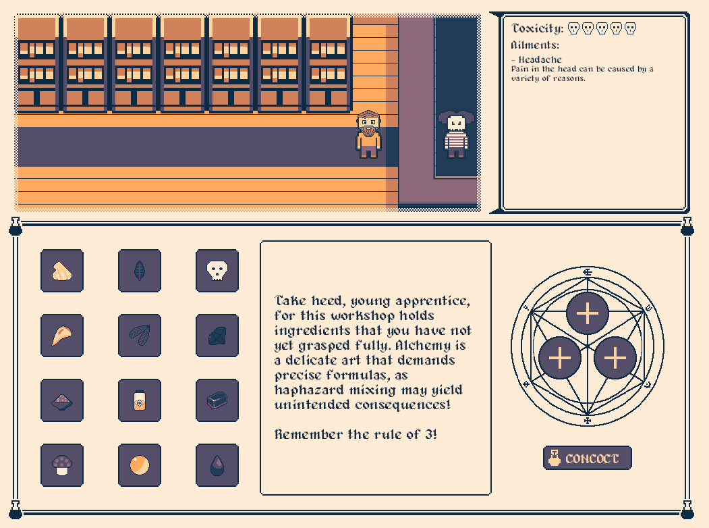

+++
date = '2023-04-01T00:00:00'
title = "Alchemist's Apprentice"
tags = ["rust", "bevy", "games", "ecs"]
+++

> This project was developed with [Alex Lepsa](https://www.linkedin.com/in/alexlepsa/)

## Summary

Alchemist's Apprentice is a game developed as an entry to Bevy Jam #3. This game jam had the requirements of building a game from scratch in a period of 10 days in the Bevy game engine. Teams were given the prompt `side effects` at the start of the jam for which their games would have to use as a theme. 

We scored 6th out 78 entires, having achieved 1st place the subcatagory for theme interpretation.

Source: https://github.com/Project-Sophon/alchemist-apprentice

Play it here: https://tsarbomb.itch.io/alchemists-apprentice

Bevy Engine: https://bevy.org/

## The Game

Help Bjorn by curing his endless host of ailments by using your master's alchemical workshop.

Take heed, young apprentice, for this workshop holds ingredients that you have not yet grasped fully. Alchemy is a delicate art that demands precise formulas, as haphazard mixing may yield unintended consequences!

<figure>
    
    <figcaption>Screenshot of the game and its art style</figcaption>
</figure>
