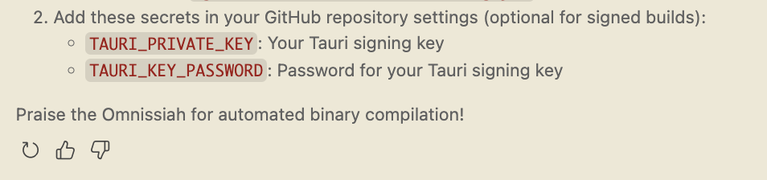

+++
date = '2025-05-01T00:00:00'
title = "Astropathic Relay"
tags = ["rust", "tauri", "vibe code", "AI", "LLM", "agent", "sshuttle"]
+++

## Summary

Astropathic Relay is a rust + tauri based application that I vibe coded over a weekend. It manages configuration and the [sshuttle](https://github.com/sshuttle/sshuttle) process for accomplishing transparent proxying, ssh tunnels, and DNS forwarding. 

Source: https://github.com/andricDu/astropathic-relay

### Solving a real world problem...
My team at the time was making very heavy use of a utility called [sshuttle](https://github.com/sshuttle/sshuttle). We had the use case of access some very locked down servers running FreeIPA/LDAP, and with the network security rules and network topology in place this required transparent proxying via ssh and DNS forwarding, hence the use of sshuttle. 

However, with multiple environments being managed, with their own access secrets, rather than maintaining shell scripts I wondered if it would make sense to "vibe code" a GUI that would allow us to easily manage and maintain these tunnels/proxies and to be able to clone configurations. 

### ...with humour
Simply solving the problem wasn't enough. I needed to have fun with it, expecially if I was going to vibe code it. I decided to use Copilot with Claude 3.7 Sonnet as my agent, and that the application we would be building and the resulting communication between me and the agent would be in the theme of the [Tech Priests of Mars](https://warhammer40k.fandom.com/wiki/Adeptus_Mechanicus) from the [Warhammer 40k](https://warhammer40000.com/) fictional universe.

<figure>
    
    <figcaption>I giggled everytime the agent shouted praise to the Omnissiah</figcaption>
</figure>

## In Action

<figure>
    
    <figcaption>The app in action</figcaption>
</figure>
